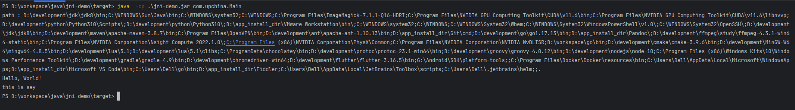

# 说明

**作为 jni 流程示例，工程开发下，动态库的编译自己可以替换成cmake的方式。**

有了完整的流程后，后面可以自己填充多的实现。本demo 不做字段映射和回调说明。有了完整的流程，这些可以自行增加，自行测试。


**推荐使用jna 的方式！**


# jni代码

## 指定代码生成路径


## 生成代码

通过maven complie 来生成代码


## 实现接口

自己手动实现自动生成的接口


# windows 平台


## 1. 编译

```cmd
g++ -shared -o ../../../lib/shawn.dll .\shawn.cpp -I"D:\development\jdk\jdk8\include" -I"D:\development\jdk\jdk8\include\win32"
```

> 注意：
>
> -I"D:\development\jdk\jdk8\include" 和 -I"D:\development\jdk\jdk8\include\win32" 必须指定 ，并且替换成你自己对应的路径


## 2. 执行

```cmd
java -Dmy_lib_path=D:\workspace\java\jni-demo\lib\shawn.dll -cp .\jni-demo.jar com.upchina.Main
```


> 注意：
>
> 在windows 平台下，指定库路径不要直接用-Djava.library.path ,会把系统库覆盖掉，导致进程无法正常启动。
>
> 可以把库放在java 的工作目录下（执行java 命令时所在的目录），java 的工作目录是java.library.path的一部分。


直接放在工作目录下的命令执行效果：

```cmd
java  -cp .\jni-demo.jar com.upchina.Main
```




# linux 平台

## 1. 编译

```shell
g++ -shared -o ../../../lib/libshawn.so shawn.cpp -I/root/tool/jdk/include -I/root/tool/jdk/include/linux -fPIC
```

> 注意：
>
> -I/root/tool/jdk/include 和 -I/root/tool/jdk/include/linux 必须指定，并且替换成你自己对应的路径


## 2. 执行

```shell
java -Djava.library.path=/mnt/d/workspace/java/jni-demo/lib -cp jni-demo.jar com.upchina.Main
```


